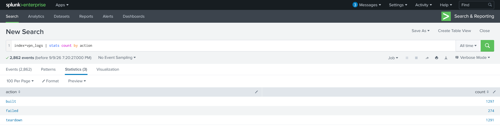
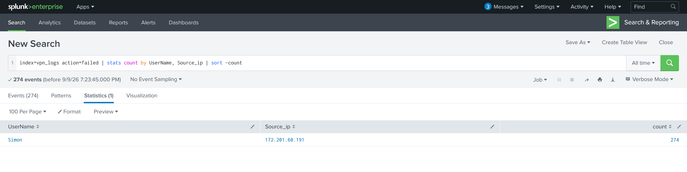
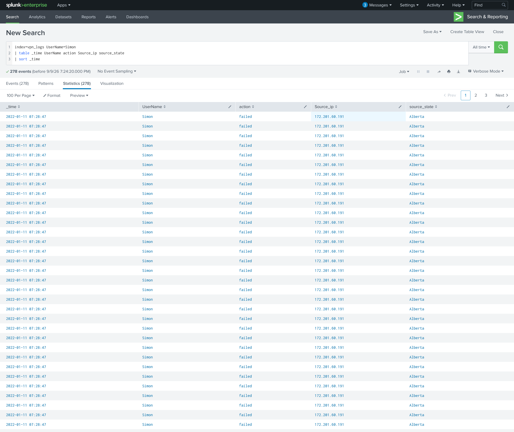

# TryHackMe — Splunk: The Basics (Writeup)

> Sala: [Splunk: The Basics](https://tryhackme.com/room/splunk101) | Nível: Easy | Duração: ~30 min
> Objetivo: entender como analistas de SOC usam o Splunk para investigar logs.

## Sobre a sala
Splunk é uma das principais soluções de SIEM do mercado, usada para coletar, analisar e correlacionar logs de rede e de máquinas em tempo real. Essa sala cobre os fundamentos da ferramenta: seus componentes, a navegação pela interface e como funciona a ingestão de logs — e fecha com uma prática de ingestão e análise em cima de um dataset real.

**Objetivos de aprendizado:**
- Entender os componentes do Splunk
- Explorar as opções disponíveis na interface
- Entender o processo de ingestão de logs
- Praticar a ingestão e análise de logs

## Ambiente
- Lab acessado via navegador (instância web do Splunk fornecida pela sala)
- Ferramentas usadas: Splunk Web, SPL (Search Processing Language)

---

## Splunk Components
Antes de sair clicando, vale entender o que compõe uma arquitetura Splunk:

- **Forwarder** — agente instalado na origem dos dados (servidor, endpoint, firewall) que coleta e envia os logs para o Indexer.
- **Indexer** — recebe os dados brutos, processa e armazena de forma indexada, otimizada para busca.
- **Search Head** — a camada onde o analista faz as buscas (SPL), monta dashboards e relatórios, consultando os dados que estão nos Indexers.

Em ambientes pequenos os três papéis podem rodar numa instância só (como é o caso do lab), mas em produção normalmente são distribuídos.

## Navegando pela interface
Depois de logar, explorei principalmente o app **Search & Reporting**, que é onde a maior parte do trabalho de um analista de SOC acontece: escrever queries SPL, salvar buscas, criar alertas e montar dashboards. Também dei uma olhada nos apps já instalados por padrão e nas configurações de índices em **Settings > Indexes**, pra entender onde os dados ficam organizados.

## Ingestão e análise de dados

### O dataset
Pra praticar a parte de ingestão, usei um arquivo de logs de VPN (`VPN-logs-1663593355154.json`) com eventos de conexão de uma empresa fictícia (`CyberT`). Cada linha é um evento JSON com campos como `UserName`, `Source_ip`, `Source_Country`, `source_state`, `EventTime`, `action` (`built`, `teardown` ou `failed`), `protocol` e `port`.

### Processo de ingestão
1. Settings → Add Data → Upload, selecionando o arquivo `.json`.
2. Sourcetype: `_json` — o Splunk reconhece automaticamente a estrutura e quebra os campos.
3. Criei um index dedicado (`vpn_logs`) pra separar esses dados de outros datasets do lab. Reparei que o campo `index` que já vem dentro do próprio JSON é só um dado do log — o index real é o que a gente define na hora do upload.

### Explorando os dados
Primeiro passo foi entender o volume geral:
```spl
index=vpn_logs | stats count by action
```


Resultado: a maioria dos eventos é `built`/`teardown` (conexões normais abrindo e fechando), mas havia uma quantidade significativa de `failed` concentrada em pouquíssimos usuários — isso chamou minha atenção.

### Achado: possível brute force na conta "Simon"
Rodando:
```spl
index=vpn_logs action=failed | stats count by UserName, Source_ip | sort -count
```


Isso já foi estranho: quase todas as falhas (274, de um total de ~2.860 eventos) eram de um usuário só, o **Simon**, e sempre vindas do mesmo IP (`172.201.60.191`, que aparece como origem Alberta/Canadá).

Fui olhar de perto o que estava acontecendo com essa conta:
```spl
index=vpn_logs UserName=Simon 
| table _time UserName action Source_ip source_state 
| sort _time
```


E aí percebi uma coisa que eu não esperava: várias das tentativas `failed` tinham **exatamente o mesmo horário**, até o segundo. No começo achei que fosse algum erro de log duplicado, mas pesquisando um pouco entendi que isso é justamente o que diferencia uma pessoa errando a senha de uma ferramenta automatizada tentando várias combinações — um humano não consegue errar a senha duas vezes no mesmo segundo, um script consegue.

Pesquisei mais sobre isso e vi que esse tipo de padrão (muitas falhas seguidas, do mesmo IP, contra a mesma conta) é conhecido como **brute force** — ou, dependendo do caso, **credential stuffing** (quando o atacante já tem uma lista de senhas vazadas e vai testando). E o que me deixou ainda mais na dúvida se era sério foi ver que, alguns dias depois dessa sequência de falhas, apareceram logins `built` (bem-sucedidos) vindos do **mesmo IP** — ou seja, parece que em algum momento uma das tentativas funcionou.

Baseado nos meus estudos até o momento, posso afirmar que esse padrão — muita falha concentrada num usuário só, timestamps repetidos, e depois um login que deu certo vindo do mesmo lugar — é motivo suficiente para abrir um alerta e investigar se a conta foi realmente comprometida.

**Resumindo o que me fez suspeitar (nessa ordem que fui percebendo):**
1. Uma quantidade de falhas muito maior que a de qualquer outro usuário.
2. Todas vindas do mesmo IP.
3. Vários timestamps idênticos — o que não parece coisa de humano digitando.
4. Login bem-sucedido logo depois da sequência de falhas.

## Conclusão
**O que aprendi fazendo isso:**
- Entendi, na prática, pra que servem o Forwarder, o Indexer e o Search Head — antes era só teoria.
- Consegui subir um arquivo JSON de verdade pro Splunk e entendi a diferença entre o campo `index` que vem dentro do log e o index de verdade que a gente escolhe na hora do upload (isso me confundiu no começo).
- Aprendi a usar alguns comandos de SPL (`stats`, `table`, `sort`) pra ir filtrando os dados até chegar numa hipótese.

---

## Reflexão final
Como ainda estou começando com Splunk, essa sala foi útil pra sair da teoria (SIEM, componentes) e realmente colocar a mão em dados de verdade. Foi a primeira vez que consegui montar uma investigação com começo, meio e fim: subir o dado, explorar, achar algo estranho, questionar se era mesmo suspeito, e no fim conseguir explicar o porquê.

Ainda tenho bastante o que aprender — principalmente sobre como criar alertas e dashboards no Splunk, e outras formas de detectar comportamento anômalo em logs de autenticação. Pretendo continuar praticando com mais datasets pra ir ganhando confiança nesse tipo de análise.
